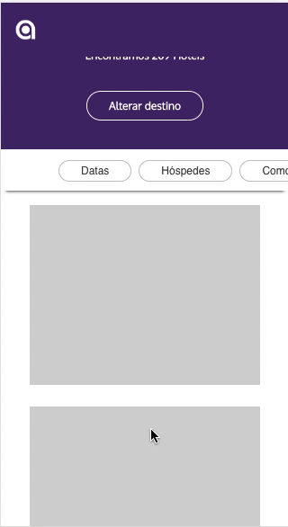
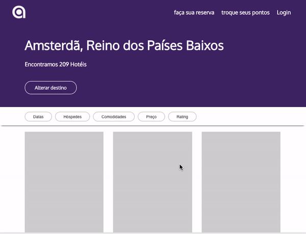
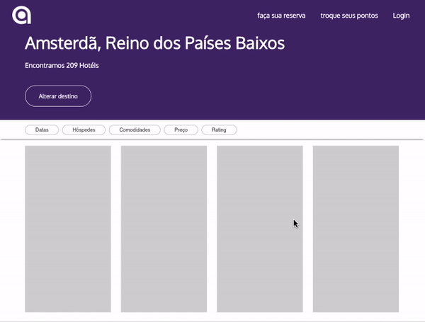

# Allpoints Website

This is a React project for allpoints website with Web, Table and Mobile version.

## Getting Started

For running the project on your local machine for development and testing purposes just follow the next steps:
- clone the project using SSH OR HTTP url
- use npm install in your terminal to install the project dependencies 
- type npm start to start the project
- Done! Now you can see it running on http://localhost:3000/

### Prerequisites

What things you need to install the software and how to install them:

- Lastest node version: https://nodejs.org/en/

### Future Implementations

This project can be improved and here goes some things that I would like to do in future to give use a better experience: 
- Use dropdown component to show navbar buttons in mobile version.
- Save the search requirements (number os guests, price, rating and others) in each filter component
- Implement clean logic in "Limpar" button from PopoverFooter component
- Use a checkbox component in "acomodações" filter
- Improve Header component performance

Please suggest you own improvements! 

## Project Preview
These are the mobile, tablet and web versions of this project

### Mobile
  
  
### Mobile
 
 
### Web
 

## Authors

* **Rebecca** 
